# 1 基础概念
## 1.1 计算机网络基础
### 1.1.1 计算机网络的概念
- 计算机网络Computer Networking：由若干结点node和连接这些结点的链路link组成
	- 结点：可以是计算机、集线器Hub、交换机Switch、路由器Router等
	- 链路：可以是有线链路、无线链路
- 互连网internet：由路由器连接的两个或多个计算机网络而组成的更大的计算机网络
- 互联网Internet：由各大ISP(Internet Service Provider, 互联网服务提供商)和国际机构组建的，覆盖全球范围的互连网internet，也称因特网
	- 互联网就是世界上规模最大的互连网 
	- 互联网必须使用 **TCP/IP协议通信**，互连网可以使用任意协议通信
### 1.1.2 计算机网络的组成和功能
#### 1.1.2.1 计算机网络的组成
##### 从组成部分看
- 硬件
	- 主机/端系统 End System：电脑、手机、物联网设备通过内部安装的网络适配器实现数据的上传下载
	- 通信设备：Hub、Switch、Router
	- 通信链路：网线、光纤、同轴电缆
- 软件
	- 方便用户使用，实现资源共享
- 协议
	- 固定计算机网络中的通信规则
	- 由硬件、软件共同实现，如：网络适配器器+软件 实现网络通信协议
##### 从工作方式看
- 边缘部分
	- 工作方式：直接为用户服务（通信、资源共享）
	- 主要由连接到互联网上的主机及其软件组成
- 核心部分
	- 工作方式：为边缘部分提供服务（连通性、交换服务）
	- 由大量网络和连接这些网络的路由器组成

##### 从逻辑功能看
- 资源子网
	- 计算机网络中运行应用程序，向用户提供可共享的硬件、软件和信息资源的部分
	- 主要由连接到到互联网上的主机组成
- 通信子网
	- 计算机网络中负责计算机间信息传输的部分。即把计算机和其他用户装置互联在一起的所有通信设备和介质的总称
	- 主要由 通信链路+通信设备+协议 构成
	- 主机内部实现信息传输的网络适配器、底层协议属于通信子网的范畴
#### 1.1.2.2 计算机网络的功能
- 数据通信：实现计算机之间的数据传输。是**最基本最重要**的功能
- 资源共享：硬件、软件、资源数据
- 分布式处理：将某个复杂任务分配给网络中多台计算机处理
- 提高可靠性：网络中各台计算机互为替代机
- 负载均衡：网络中各台计算机共同分担繁重任务
### 1.1.3 三种交换技术
#### 1.1.3.1 电路交换 Circuit Switching
- 通过物理线路的连接，动态地分配传输线路资源
- 电路交换的过程：
	1. 建立连接，尝试占用通信资源
	2. 通信，一直占用通信资源
	3. 释放连接，归还通信资源
- 优点：通信前从主叫端到被叫端建立一条专用的物理通路，在通信的全部时间内，两个用户**始终占用**端到端的线路资源，数据直送，**传输速率高**
- 缺点
	- 建立/释放连接需要**额外的时间开销**
	- 线路被通信双方**独占**，利用率低
	- 线路分配的**灵活性差**
	- 交换节点不支持**差错控制**
- 电路交换适用于：低频次、大量地传输数据，与计算机之间“突发式”、高频次、少量的传输特点不匹配
#### 1.1.3.2 报文交换 Message Switching
- 报文信息Message由两部分组成：控制信息+用户数据
- 存储转发的思想：把传输的数据单元先**存储**到中间节点，再根据目的地址转发到下一节点
- 优点
	- 通信前**无需建立联系**
	- 数据以**报文Message**为单位被交换节点之间“**存储转发**”，通信**线路可以灵活分配**
	- 在通信时间内，两个用户**无需独占**一整条物理线路。相比于电路交换技术，**线路利用率高**
	- 交换节点支持通过**校验技术**进行**差错控制**
- 缺点
	- Message**不定长**，不方便存储转发管理
	- 长报文的存储转发**时间开销和缓存开销大**
	- 长报文**容易出错**，重传代价大
#### 1.1.3.3 分组交换 Packet Switching
- 分组思想：将不定长的报文信息进行分组得到的每个Packet是定长的。Packet由两部分组成：首部Header和数据Message，Header包括源地址、目的地址，分组号等信息
- 优点
	- 继承了报文交换的所有优点
	- 数据以**分组Packet**为单位被交换节点之间“**存储转发**”，通信**线路可以灵活分配**
	- 相比报文交换
		- 分组定长，方便存储转发
		- 分组的存储转发时间开销和缓存开销小
		- 分组不易出错，重传代价低
- 缺点
	- 相比于报文交换，控制信息占比增加，信息密度降低
	- 相比于电路交换，依然存在存储转发时延
	- 报文被拆分为多个分组，传输过程中可能出现失序、丢失等问题，增加处理的复杂度

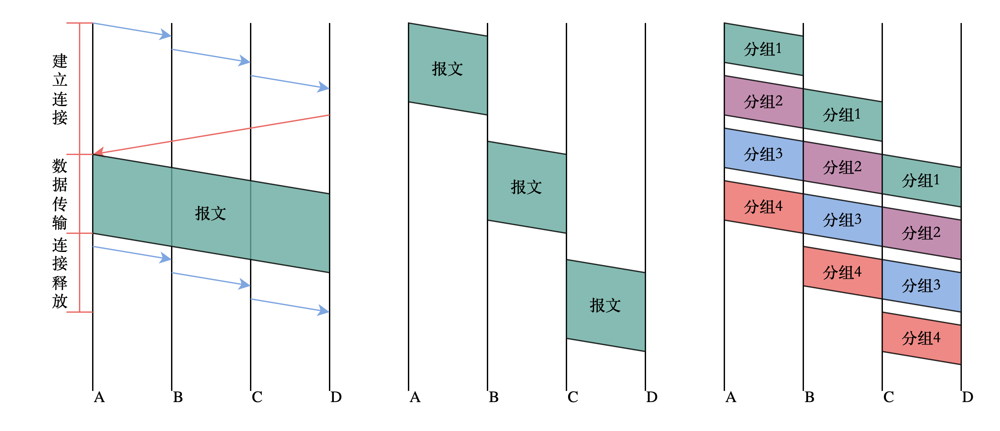
<figcaption><b>fig 1.1.3</b> - 三种交换技术对比</figcaption>

|                               项目 | 电路交换 | 报文交换 | 分组交换 |
| -------------------------------: | ---- | ---- | ---- |
|                 传输时间 $\downarrow$ | 最少   | 最多   | 较少   |
|               存储转发时延 $\downarrow$ | 没有   | 较高   | 较低   |
|                          通信前建立连接 | 是    | 否    | 否    |
|   缓存开销 $\displaystyle \downarrow$ | 无    | 高    | 低    |
|                             差错控制 | 不支持  | 支持   | 支持   |
|                         报文数据有序到达 | 是    | 是    | 否    |
| 额外控制信息 $\displaystyle \downarrow$ | 无    | 少    | 多    |
|                          线路分配灵活性 | 不灵活  | 灵活   | 非常灵活 |
|    线路利用率 $\displaystyle \uparrow$ | 低    | 高    | 非常高  |
### 1.1.4 计算机网络的分类

- 分布范围：**广域网**、城域网、**局域网**、个域网
	- 广域网 Wide Area Network WAN，几十km以上的远距离通信
	- 城域网 Metropolitan Area Network MAN，数十千米以内的中距离通信，常采用以太网技术，因此长并入局域网讨论
	- 局域网 Local Area Network LAN，范围在几十到几千米，使用以太网作为通信技术
	- 个域网 Personal Area Network PAN，通常使用无线技术将个人设备连接起来，因此也常称为无线个域网WLAN
- 传输技术：广播式网络、点对点网络
	- 广播式：当一台计算机发送数据分组时，广播范围内所有计算机都会收到该分组，并通过**检查分组的目的地址**决定是否接收该分组
	- 点对点：数据只会从发送方“点对点”发送到接收方，精准送达
- 拓扑结构：**总线形**、**环形**、**星形**、**网状**
	- 总线形：数据**广播式**传输；存在“总线争用”问题，总线同一时刻只有一条数据，典型代表为集线器Hub
	- 环形：数据**广播式**传输；通过“token”解决总线争用问题，令牌顺环形依次传递，拿到令牌者可以使用总线
	- 星形：由中央设备实现数据的点对点传输；不存在“总线争用”问题。典型代表为以太网交换机连接的设备
	- 网状：数据通过各中间节点逐一存储转发；属于点到点传输。典型代表为由众多路由器构建的广域网。具有灵活、高可靠性、控制复杂、线路成本高的特点
	- 前三种主要用于LAN，后一种主要用于WAN
- 使用者：公有网、专用网
- 传输介质：有线网络、无线网络
### 1.1.5 计算机网络的性能指标
#### 1.1.5.1 速率、带宽、吞吐量
- **信道Channel**：表示向某一方向传送信息的通道。信道≠通信线路，一条通信线路在逻辑上往往对应一条发送信道和一条接收信道
- **速率Speed**：指连接到网络上的节点在信道上传输数据的速率，也称数据率或比特率、数据传输速率。单位有bit/s(b/s、bps)
	- 1Byte=8bits
	- $\displaystyle 1T=10^{3}G=10^{6}M=10^{9}K=10^{12}$
- **带宽Bandwidth**：某信道所能传送的最高数据率，反应信道的数据传输能力
	- 从通信的角度可定义为：某信道允许通过的信号频带范围，单位为Hz
	- 节点间通信实际能达到的最高速率，由带宽、节点性能共同限制
- **吞吐量Throughput**：指单位时间内通过某个网络（或信道、接口）的**实际数据量**。吞吐量受带宽限制、受复杂的网络负载情况影响。网线的吞吐量等于网线连接的两个方向信道的吞吐量的总和
#### 1.1.5.2 时延、时延带宽积、往返时延
- **时延Delay**：指数据从网络或链路的一端传输到另一端所需要的时间。也称为延迟或迟延。
	- 总时延=发送时延+传播时延+处理时延+排队时延
	- 发送时延：由称传输时延，指节点将数据推向信道所花费的时间
		- =数据大小/发送速率
	- 传播时延：电磁波在信道中传播一定距离所话费的时间
		- =信道长度/电磁波在信道中的传播速度
	- 处理时延：被路由器处理所花费的时间，如分析首部、查找存储转发表
	- 排队时延：数据排队进入、排队发出路由器所花的时间
		- 处理时延和转发时延受网络负载、路由器性能等多因素共同影响
- **时延带宽积**=传播时延 $\displaystyle \times$ 带宽，单位为bit，其含义为，一条链路中，**已经**从发送端发出但是尚未被接收端接收的**最大比特数**，取决于信道长度和电磁波在信道中的传输速度
	- 主要用于设计最短帧长
- **往返时延Round-Trip Time, RTT**：表示从发送方发送完数据，到发送方接收到来自接受方的确认总共经历的时间
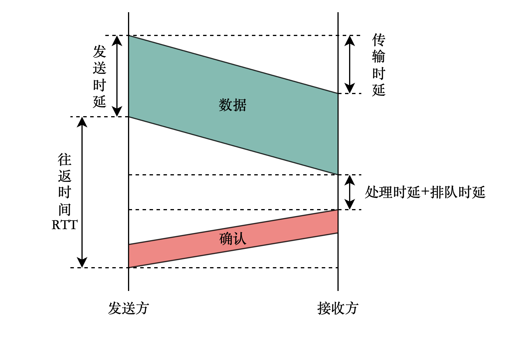
$$
\begin{align}
往返时延&=数据的单向传播时延\\
&+接受方收到数据后的处理时延\\
&+确认的发送时延\\
&+确认的传播时延\\
\end{align}
$$
#### 1.1.5.3 信道利用率
信道利用率指某个信道有数据通过的时间占比
$$
\text{信道利用率}=\frac{\text{有数据通过的时间}}{有数据通过的时间+没有数据通过的时间}
$$
信道利用率不能太低，会浪费通信资源
信道利用率也不能太高，容易导致网络拥塞

## 1.2 计算机网络的分层结构
### 1.2.1 分层的设计思想
分层：将庞大而复杂的问题，转化为若干较小的局部问题。
将复杂的计算机网络在逻辑上划分为多个层次，并将各种“功能”安排在合适的层次中
不同类型的节点，实现的功能层次不一样
分层的设计也不是固定的，只要功能分配合理即可
### 1.2.2 三种常见的计算机网络体系结构
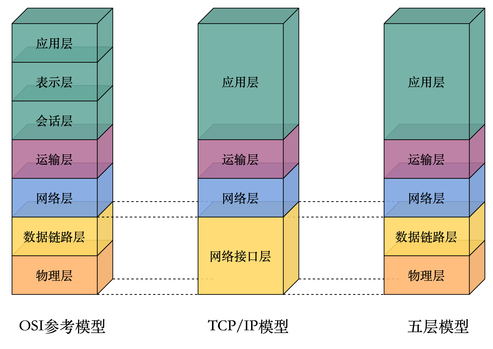

|       OSI参考模型       |          TCP/IP模型           |          五层模型          |
|:-----------------------:|:-----------------------------:|:--------------------------:|
|      法律上的标准       |         事实上的标准          |         教学用标准         |
| 由国际标准化组织ISO提出 | 美国防部ARPANRT项目的后续成果 | 综合前两者，便于学习和理解 |
- **网络的体系结构Network Architecture**：计算机网络的各层及其协议的集合，就是这个计算机网络及其构件所应完成的**功能的精确定义，不涉及实现**。
- **实现Implementation**：遵循这种体系结构的前提下，用何种硬件或软件完成这些功能的问题。
- *体系是抽象的，实现是具体的*
### 1.2.3 各层之间的关系
- **实体**：在计算机网络的分层结构中，第n层中的活动元素（软件+硬件）通常称为第n层实体。不同机器上的同一层称为**对等层**，同一层的实体称为**对等实体**
- **协议Protocol**：即网络协议，是控制对等实体之间进行通信的规则的集合，是**水平**方向的
- **接口Interface**：即同一节点内**相邻两层的实体**交换信息的逻辑接口，又称为服务访问点Service Access Point，SAP
- **服务Service**：指下层为**紧邻上层**提供的功能调用，是垂直方向的
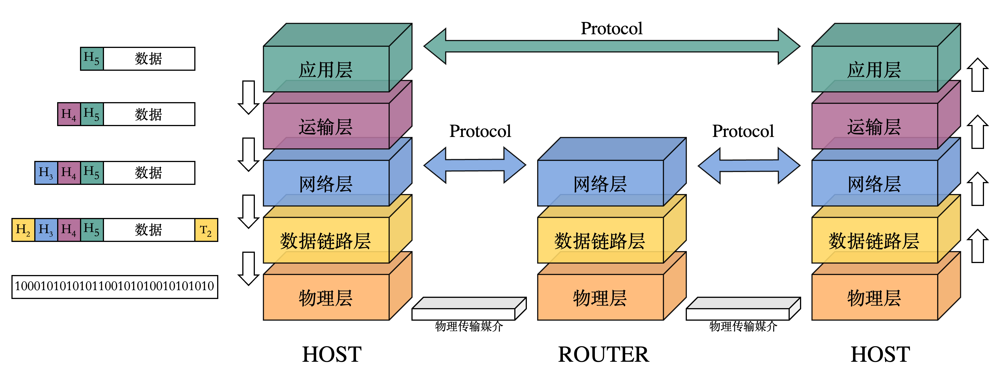
- **协议数据单元PDU**：对等层次之间传送的数据单位。第n层的PDU记为n-PDU
- **服务数据单元SDU**：为完成上一层实体所需要的功能而传送的数据。第n层的SDU记为n-SDU
- **协议控制信息PCI**：控制协议操作的信息。第n层的PCI记为n-PCI
- 本层的PDU为PCI和SDU的和，本层的PDU会作为上一层的SDU，即n-SDU+n-PCI=n-PDU=(n-1)SDU

##### 协议三要素
协议由**语法、语义和同步**三部分组成，又称为协议三要素
- **语法**，数据与控制信息的格式。例如，协议控制信息(首部)占多少字节、每个字节的含义；协议的数据部分最多多少字节等
- **语义**，即需要发出何种控制信息、完成何种动作及做出何种应答。例如，协议中需要明确规定：发送方发完数据后，接收方是否需要“应答”，以及应答的种类有哪些（如：传输成功、传输失败）
- **同步或时序**，执行各种操作的条件、时序关系等，即事件实现顺序的详细说明。例如，发送方发完数据后，接收方需要立即“应答”；如果10s内未收到“传输成功”应答，则发送方将再次发送数据

#### 1.2.3.1 OSI参考模型
- 各层的顺序和名称：**物联网叔会使用**：**物**理层、数据**链**路层、**网**络层、传**输**层、**会**话层、表**示**层、应**用**层
- 常见网络设备的功能层次
	- 主机：全部
	- 集线器Hub：物理层
	- 交换机Switch：物理层、数据链路层
	- 路由器Router：物理层、数据链路层、网络层
	- 网线、光纤：第0层，作为物理传输媒体

- 物理层：实现相邻结点之间比特01的传输
	- 需定义电路接口参数，如形状、尺寸、引脚数等
	- 需定义传输信号的含义、电气特征，如5V表示1，1V表示0；每比特电信号持续时间0.1ms
- 数据链路层：确保相邻结点之间的链路**逻辑上无差错**
	- **差错控制**：检查+纠错，或 检错+丢弃+重传
	- 流量控制：协调两个节点的传输速率
- 网络层：把“分组”从源结点转发到目的结点
	- **路由选择**：构造并维护路由表，决定分组到达目的结点的最佳路径
	- **分组转发**：将“分组”从合适的端口转发出去
	- 拥塞控制：发现网络拥塞，并采取措施缓解拥塞
	- 网际互联：实现异构网络互联
	- 其他功能：*差错控制、流量控制*、连接建立与释放、可靠传输管理
		- 此处的差错控制、流量监控是以*分组Packet*为单位的，数据链路层是以*帧Frame*为单位的。换言之，数据链路层只能保证每个帧的信息是正确的，但是无法保证帧和帧之间可以正确组成分组，而这一功能就是网络层需要实现的
		- 连接建立与释放：确保分组有序、不重复到达
		- 可靠传输管理：接收方需返回分组确认消息
- 传输层：实现端到端通信，即实现进程到进程的通信，此处“端”指“端口”
	- 复用和分用：发送端几个高层实体复用一条低层的连接，在接收端再进行分用
	- 其他功能：*差错控制、流量控制*、连接建立与释放、可靠传输管理
		- 此处的差错控制、流量控制是以报文段Segment为单位的，每个报文段分为若干个分组Packet，每个分组分为若干个帧Frame
- 会话层：管理进程间会话，主要功能为会话管理，采用检查点机制，当通信失效时从检查点继续恢复通信（断点续传）
- 表示层：解决不同主机上信息表示不一致的问题，主要功能为数据格式转换，如编码转换、压缩/解压缩、加密/解密
- 应用层：实现特定的网络应用，功能繁多，根据应用需求设计

数据的**分段**和**重装**是贯穿各层的功能
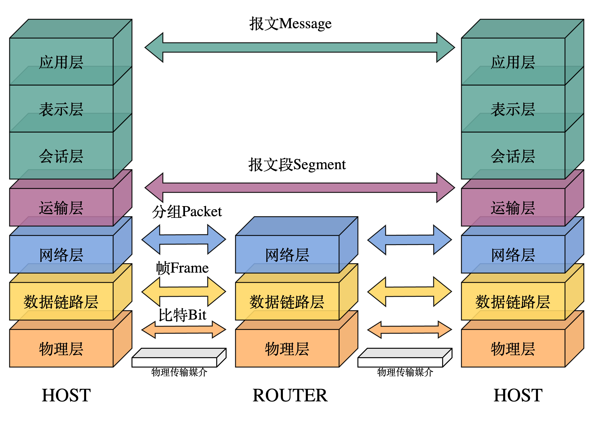
#### 1.2.3.2 TCP/IP模型
各层的名称和顺序：**接网叔用**：网络**接**口层、**网**络层、**传**输层、应**用**层

TCP/IP模型认为并不是所有的网络应用都需要数据格式转换、会话管理功能，因此将OSI模型上三层合并为应用层。如果某些应用需要这些功能，就交给应用层的特定协议去实现。

并且，网络硬件种类繁多，不应该有过多的限制，不利于技术创新。因此将OSI模型的下两层合并为网络接口层，它的任务是实现相邻节点间的数据传输，为网络层传输“分组”，但具体的技术实现不作限制。

上两种设计理念使得TCP/IP模型网络体系结构具有更强的灵活性、适应性。

TCP/IP模型的网络层**去除**了差错控制、流量控制、连接建立与释放、可靠传输管理这些功能，使得网络接口层不完全可靠，接收到的分组可能有差错。网络层只保证“尽最大能力交付”，数据传输是不可靠的。

相应的，差错控制、流量控制、连接建立与释放、可靠传输管理这些功能在TCP/IP模型中全部依靠**传输层**完成。这一改动使得TCP/IP模型的网络核心设备如Router，精简了很多不必要的功能，使得功能简单，负载更低，造价也相应更低。

数据传输的正确与可靠由传输层负责，把压力给到网络的边缘设备，也就是主机。
# 2 物理层
## 2.1 通信基础
### 2.1.1 通信基础
#### 2.1.1.1 信源、信宿、信号、信道
- 信源：信号的来源，发送方
- 信宿：信号的归宿，接收方
- 数据：信息的实体，如文字、声音、图像，在计算机内部数据通常为比特流
- 信号：数据的载体，分为数字信号和模拟信号
	- 数字信号：信号值是离散的
	- 模拟信号：信号值是连续的
	- 码元：信息的最小单位，信号周期称为码元宽度，比如0和1可以是码元，00、01、10、11也可以是码元
		- 每个信号周期可以传输更多的信息，即每个码元可以携带更多信息
		- 代价是需要加强信号功率，并且对信道的要求更高
		- 一个周期内可能出现的信号数为k，则1码元= $\displaystyle \log_{2} k$ bit
- 信道：一条物理线路通常包含两条信道，即发送信道和接收信道
#### 2.1.1.2 速率、波特率、比特率
- 速率：单位时间数据传输的速度
	- 波特率：每单位时间传输几个码元，单位码元/秒或波特（Baud）
	- 比特率：每单位时间传输几个比特，单位bps
	- 相互转换就是要关注一码元等于几比特
### 2.1.2 信道的极限容量
- 带宽Bandwidth
	- 在计算机网络中，表示某信道所能通过的“**最高数据率**”，单位bps
	- 在通信领域中，表示某信道所允许通过的**信号频率范围**，单位Hz
	- 本质一样，都是衡量信道传输数据能力的指标
- 噪声：对信道产生干扰，影响信道的数据传输率
#### 2.1.2.1 Nyquist 奈奎斯特定理 奈氏准则
奈奎斯特定理：对于一个**理想低通信道**（**没有噪声**、带宽有限的信道）：
$$
极限波特率=2W
$$
，其中W是信道的频率带宽，单位Baud，码元/秒。若1个信号周期内可能出现k种信号，则 $\displaystyle 1码元=\log_{2} k$ bit，则：
$$
极限比特率=2W\log_{2}k\space\text{bps}
$$
- 奈奎斯特定理说明
	- 如果波特率太高，会导致“码间串扰”，即接收方无法识别码元
	- 带宽越大，信道传输码元的能力越强
	- 奈奎斯特定理并未对一个码元最多可以携带多少比特做出解释
#### 2.1.2.1 香农定理
香农定理：对于一个**有噪声**、**带宽有限**的信道：
$$
极限比特率=W\log_{2}\left( 1+\frac{S}{N} \right)\space\text{bps}
$$
，其中其中W是信道的频率带宽，S/N（Signal/Noise）是信噪比，其计算方法为
$$
\frac{S}{N}=\frac{信号的功率}{噪声的功率}
$$
，信噪比越高，噪声对数据传输的影响越小。提升信噪比的两种途径：提高信号功率和降低噪声功率。
在通信领域，信号功率往往比噪声功率大得多，因此为了方便表示，通常使用分贝dB为单位表示信噪比：
$$
信噪比=10\log_{10} \frac{S}{N}\space\text{dB}
$$
但是香农定理中的 $\displaystyle \frac{S}{N}$ 是无单位的信噪比，计算时需要转换：
$$
无单位信噪比=10^{有单位信噪比/10}
$$
- 香农定理说明
	- 提升信道带宽、加强信号功率、抑制噪声功率都可以提高信道的极限比特率
	- 结合奈奎斯特定理，可以知道，在带宽、信噪比确定的信道上，**一个码元可以携带的比特数是有上限的**
### 2.1.3 编码和调制
#### 2.1.3.1 编码与解码、调制与解调
- 编码：将二进制数据转换为数字信号
- 解码：将数字信号转换为二进制数据
- 调制：将二进制数据转换为模拟信号
- 解调：将模拟信号转换为二进制数据
- 变换器：将二进制数据转换为信号
- 反变换器：将信号转换为二进制数据

有线网络适配器（网卡）就是一种编码-解码器
光猫Optical Modem就是一种调制解调器Modulator-Demodulator
#### 2.1.3.2 常用的编码方式

| 编码名称         | 缩写       | 特点                                                               |
| ---------------- | ---------- | ------------------------------------------------------------------ |
| 不归零编码       | NRZ        | 低0高1，中不变                                                     |
| 归零编码         | RZ         | 低0高1，**中归零**，归零相当于给出时钟信号，方便接收方分清信号边界 |
| 反向非归零编码   | NRZI       | 跳0不挑1看起点，中不变                                             |
| 曼彻斯特编码     | Manchester | 跳0反跳1看中间，中必变，上0下1（IEEE）                             |
| 差分曼彻斯特编码 | DM         | 跳0不跳1看起点，中必变，跳变可以作为时钟信号使用                   |

| 编码名称     | 自同步能力             | 带宽利用 | 抗干扰能力 |
| -------- | ----------------- | ---- | ----- |
| 不归零编码    | 无                 | 高    | 弱     |
| 归零编码     | 有                 | 低    | 弱     |
| 反向非归零编码  | 若增加冗余位(8+1bit)可支持 | 中等   | 弱     |
| 曼彻斯特编码   | 有                 | 低    | 强     |
| 差分曼彻斯特编码 | 有                 | 低    | 强     |

关于带宽利用，传输同一个数据需要用到多种信号，比如归零，跳变，都会使得一个数据占用多个信号，造成带宽浪费
#### 2.1.3.3 常用的调制方式

- 调幅AM：又称幅移键控ASK，调整振幅
- 调频FM：又称频移键控FSK，调整频率
- 调相PM：又称相移键控PSK，调整相位
- 正交幅度调制QAM：将AM和PM进行结合，形成叠加信号。若设计m种幅值、n种相位，则将AM、PM信号两两结合，可以调制出mn种信号，则QAM的1码元= $\displaystyle \log_{2}mn$ bit。“QAM-16”的含义是：采用QAM调制技术，有16种码元，相当于一码元携带4bit信息
## 2.2 传输媒介 Transmission Medium
### 2.2.1 常用的传输介质
#### 2.2.1.1 导向型传播介质
**信号朝固定方向传播**，如双绞线、同轴电缆、光纤
- 双绞线 Twisted Pair
	- 主要构成：两根导线相互**绞合**而成
		- 有屏蔽层=屏蔽双绞线STP Shielded TP
		- 无屏蔽层=非屏蔽双绞线UTP Unshielded TP
	- 抗干扰能力：较好。绞合、屏蔽层可以提升抗电磁干扰能力
	- 代表应用：近些年的局域网、早期电话线
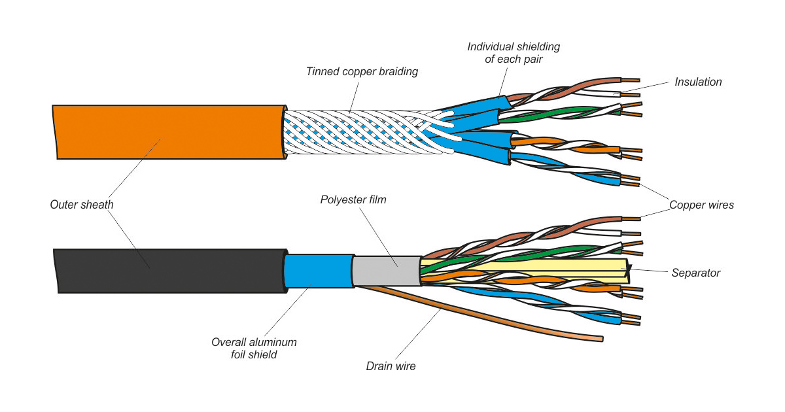
- 同轴电缆  Coaxial Cable
	- 主要构成：内导体（用于传输信号）+外屏蔽层（用于抗电磁干扰）。内导体越粗，电阻越低，传输过程中信号衰减越少，传输距离越长
	- 抗干扰能力：好，屏蔽层带来良好的抗干扰性
	- 代表应用：早期局域网、早期有线电视
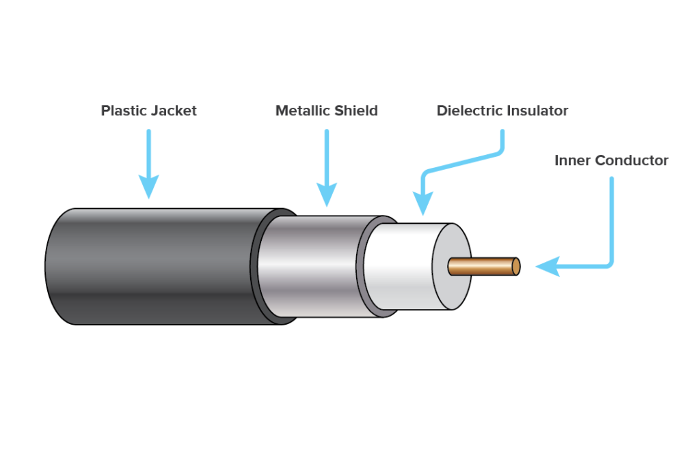
- 光纤 Optical Fiber
	- 主要构成：纤芯（高折射率）+包层（低折射率）。利用光的**全反射特性**，在纤芯内传输光脉冲信号
	- 分类
		- 单模光纤，只有**一条光线**在一根光纤中传输，适合**长距离传输**，信号传输损耗小
		- 多模光纤，多条光线在一根光纤中传输，适合**近距离传输**，远距离传输光信号容易失真
		- 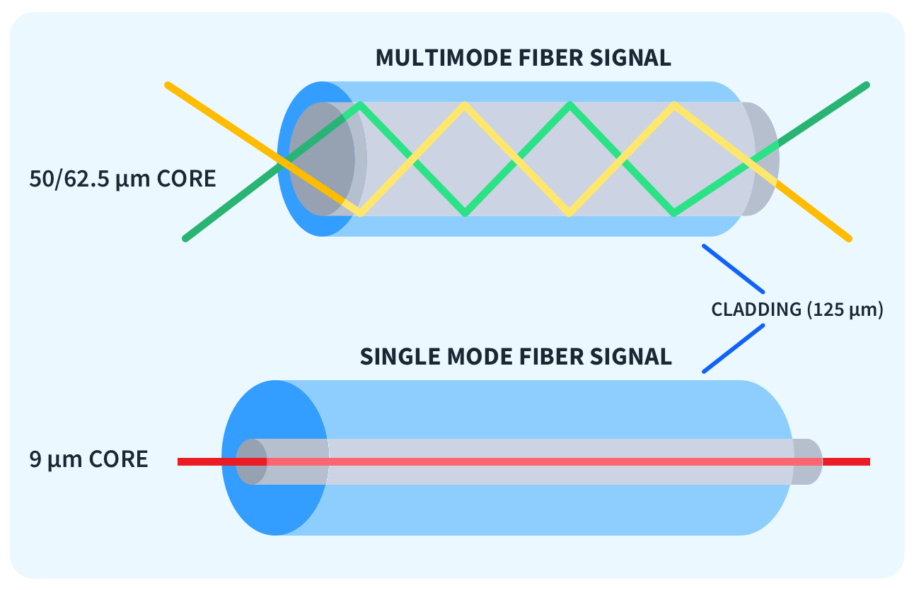
	- 抗干扰能力：非常好，光信号对电磁干扰不明显
	- 其他优点：信号传输损耗小，长距离传输时中继器少，很细很省布线空间
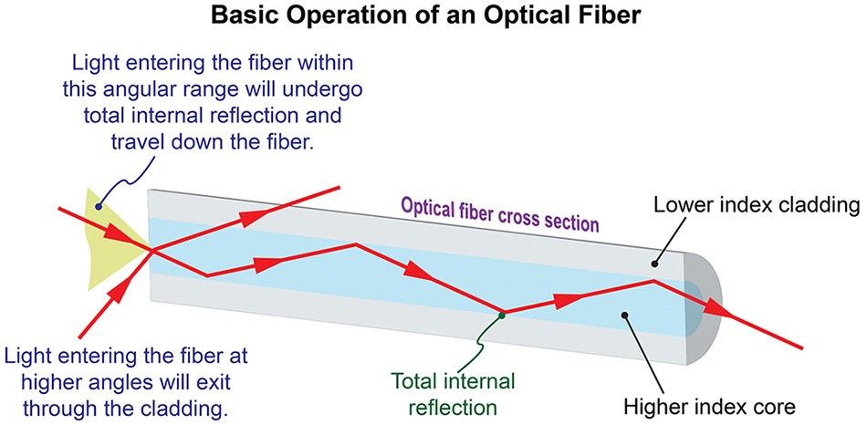

- 以太网对有线传输介质的命名规则
	- 速度+Base+介质信息，其中Base是Baseband，基带传输，以太网采用曼彻斯特编码
	- 10Base5：10Mbps，同轴电缆，最远传输距离500m
	- 10Base2：10Mbps，同轴电缆，最远传输距离200m（实际185）
	- 10BaseF\*：10Mbps，光纤。\*可以是其他信息，如10BaseFL、10BaseFB
	- 10BaseT\*：10Mbps，双绞线。\*可以是其他信息，如10BaseT1S、10BaseF1L
#### 2.2.1.2 非导向型传输介质
主要是无线传播介质
- 无线电波
	- 特点：穿透能力强、传输距离长、信号指向性弱
	- 如手机信号、WiFi
- 微波通信
	- 特点：频率带宽高、信号指向性强、保密性差（容易被窃听）
	- 如卫星通信（卫星作为信号中继器，传播时延较大）
- 其他：红外线通信、激光通信，信号指向性强

- 本质上都是用电磁波。根据电磁波公式 $\displaystyle c=\lambda f$
	- 波长越短，频率越高，数据传输能力越强
	- 波长越短，信号指向性越强，信号越趋近于直线传播
	- 波长越长，“绕射性”越好，信号的穿透能力越强
- 结论：长波更适合长距离、非直线通信。短波更适合短距离高速通信，若用于长距离通信需要建立中继站；短波信号指向性强，要求信号接收器对准信号源
### 2.2.2 物理层接口的特性
- 机械特性：指明接口所用接线器的形状和尺寸、引脚数目和排列、固定和锁定装置等
- 电气特性：指明在接口电缆的各条线上出现的电压的范围、传输速率、距离限制等
- 功能特性：指明某条线上出现的某一电平的电压的意义
- 过程特性/规程特性：指明对于不同功能的各种可能事件的出现顺序
## 2.3 物理层设备
### 2.3.1 中继器 Repeater
- 中继器只有两个端口，通过一个端口接收信号，**将失真信号整形再生**，并转发到另一个端口，代价是信号再生会产生一些时延
- **仅支持半双工通信**，即两端连接的节点**不可以同时发送数据**，会导致“冲突”
- 中继器两个端口对应两个**网段**
### 2.3.2 集线器 Hub
- 本质上是**多端口中继器**。集线器将其中一个端口接收到的**信号整形再生后，转发到其他所有端口**
- 各端口连接的节点**不可同时发送数据**，会产生冲突
- 集线器的N个端口对应N个**网段**，各网段属于同一个**冲突域**
	- 冲突域：也称为碰撞域。如果两台主机同时发送数据会导致冲突，则这两台主机处于同一个冲突域。处于同一冲突域的主机在发送数据前需要进行“**信道争用**”。
	- 凡是由集线器连接的网络都属于同一个冲突域，换言之，**集线器无法隔离冲突域**

集线器、中继器**不能无线串联**，如10Base5的5-4-3原则：使用集线器或中继器连接10Base5网段时，最多只能串联5个网段，使用4台集线器或中继器，只有3个网段可以连接计算机。这是由以太网技术所限制的

集线器连接的网络，从物理上看是星形拓扑，但逻辑上是总线形拓扑，因为数据是广播式传输的，存在信道争用问题

**集线器连接的各网段会共享带宽**，每台主机能分到的带宽= $\displaystyle \frac{总带宽}{网段数}$
集线器可以连接不同的传输介质，因此各个网段的物理层接口特性可以不同，这就意味着集线器连接的网段，“物理层协议”可以不同

集线器如果连接了速率不同的网段，会导致所有网段“速率向下兼容”

# 3 数据链路层
## 3.1 数据链路层的基本介绍
- 数据链路层的地位
	- 使用**物理层**提供的“比特传输”服务
	- 为**网络层**提供服务，将网络层的IP数据报(分组)封装成帧Frame，传输给下一个相邻节点
- 物理链路：传输介质(第0层)和物理层实现相邻节点之间的“物理链路”
- 逻辑链路：数据链路层需要基于“物理链路”，实现相邻节点之间逻辑上无差错的“数据链路(逻辑链路)”
## 3.2 组帧
### 3.2.1 主要问题
- 帧定界：如何让接收方能够确定帧的界限
- 透明传输：接收方要能够去除“帧定界”的附加信息，把帧“恢复原貌”
### 3.2.2 四种组帧方法
- 字符计数法
	- 原理：在每个帧开头，用一个**定长计数字段**表示帧长
	- 帧长=计数字段长度+帧的数据部分的长度
	- 缺点：任何一个计数字段出错，都会导致后续所有帧无法定界
- 字节填充法
	- 原理：在数据的前面增加一个控制字符SOH(Start Of Head, 01H)，在数据的最后增加一个控制字符EOT(End Of Transmission, 04H)
	- 如果帧的数据部分包含“**特殊字符**”(控制字符和转义字符等)，则**发送方**需要在这些“特殊字符”前面填充“**转义字符ESC**(escape character, 1BH)”，由**接收方**做**逆处理**
- 零比特填充法
	- 原理：约定以一串特殊的二进制串作为帧的开始和结束
	- 实际应用中，通常以`01111110`作为开始/结束标志
	- 为了解决传输数据包含`01111110`的情况，**发送方**发送数据时，**数据部分每遇到连续的5个1就填充一个0**，这样只有首尾部分可能出现连续的6个1
	- **接收方**需要对帧的数据部分进行逆处理，每当遇见连续的5个1，就删掉后面的0
	- HDLC协议、PPP协议采用此方法 
- 违规编码法
	- 原理：如果数据部分采用曼彻斯特编码，则如果周期中间不跳变，则“违规”，使用“违规”信号表示帧的开头和结尾
	- 需要物理层配合在数据的首尾插入“违规编码”
## 3.3 差错控制
- 目标：发现并解决一个帧内部的“**位错**”
- 方案一：接收方发现比特错误后**丢弃帧**，并通知发送方**重传帧**
	- 对应检错编码：奇偶校验码、CRC校验码
- 方案二：由接收方**发现并纠正**比特错误
	- 对应纠错编码：海明校验码
### 3.3.1 检错编码
- 奇偶校验
	- 奇校验码：整个校验码（有效信息位和校验位）中“1”的个数位奇数
	- 偶校验码：整个校验码（有效信息位和校验位）中“1”的个数位偶数
	- 检验位可以增加在最高位或者最低位
	- 实际应用过程中，偶校验会比奇校验更加常用，因为偶校验可以很方便使用硬件实现：各信息进行异或运算，得到的结果即为偶校验位
		- 比如1001的偶校验位可以由 $\displaystyle 1\oplus 0\oplus 0\oplus 1=0$ 得到
		- 接收方进行校验同样可以对整个校验码使用异或运算，若最终结果等于0则信息无误，结果为1说明出错
	- 无法校验偶数位错误，比如两个位同时跳变则检错失效
- CRC校验 循环冗余校验 Cyclic Redundancy Check
	- 基本思想：数据收发双方约定一个“除数”，K个信息位+R个校验位作为“被除数”，添加校验位后需要保证除法的余数为0。收到数据后，进行除法检查余数是否为0；余数非0说明传输出错

CRC校验码构造例题：设生成多项式为 $\displaystyle G(x)=x^{3}+x^{2}+1$ ，信息码为101001，求对应的CRC码
1. 确定K、R以及生成多项式对应的二进制码
2. 移位：信息码左移R位，低位补0
3. 相除：对移位后的信息码，用生成多项式进行**模2除**法，产生余数
4. 检错和纠错

此题K=信息码的长度=6，R=生成多项式最高次幂=3 $\displaystyle \implies$ 校验码的最高位数 $\displaystyle N=K+R=9$
生成多项式 $\displaystyle G(x)=1\cdot x^{3}+1\cdot x^{2}+0\cdot x^{1}+1\cdot x^{0}$ 对应二进制码1101
用移位后的1011001除以1101得到余数001，则对应的CRC码为101001 001
接收方使用1101进行模二除，若余数为000，则传输没有出错；否则传输出错

模二除法：
- ​核心机制：基于异或运算（XOR），不涉及进位或借位
    - 每一位计算结果仅取决于当前位，不依赖高位或低位。
    - 例如：`1-1=0`、`0-1=1`（实际为异或操作）。
- ​商确定规则：被除数当前位为1则商1，为0则商0，不比较大小

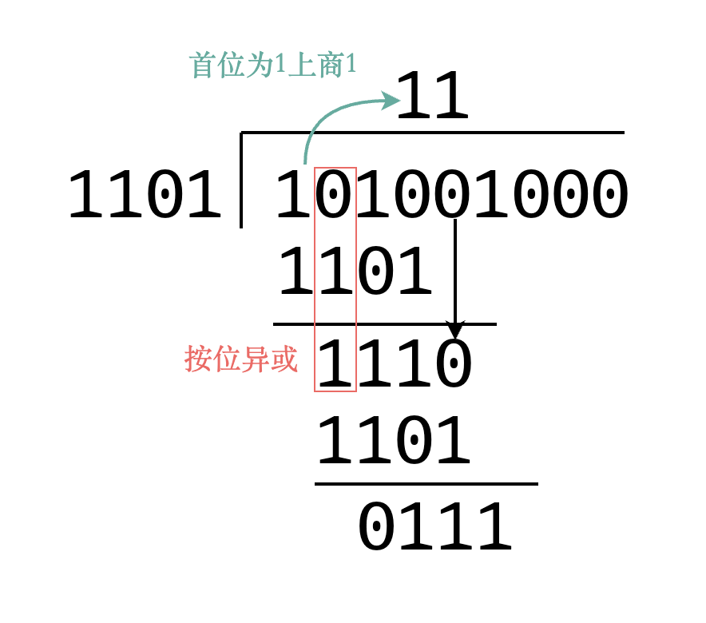
对于确定的生成多项式，**出错位和余数是相对应的**，R个校验位可以表示R种出错信息。对于K个信息位，R个校验位，若生成多项式选择得当，且 $\displaystyle 2^{R}\geq K+R+1$ ，则CRC码可纠正1位错( $\displaystyle 2^{R}-1$ 种错误状态和一种正确状态)
但是实际应用应用过程中传输数据位数和校验位数无法满足上面的不等式，所以一般CRC码只用来检错

- 理论上可以证明CRC码检错能力有以下特点
- 可检测出所有奇数个错误
- 可检测出所有双比特错误
- 可检测出所有小于等于检验位长度的连续错误

### 3.3.2 纠错编码 海明码
海明码的设计思路：将信息位分组进行偶校验，设置多个校验位，多个校验位能携带更多种状态信息(对/错、错在哪)
海明码的核心思想就是通过若干分布在特定位置的校验码，进行若干次二分偶校验检查，最终可以确定错误位置。
以(15,11)海明码为例，校验位分布在第1、2、4、8位，第0位作为整体校验。
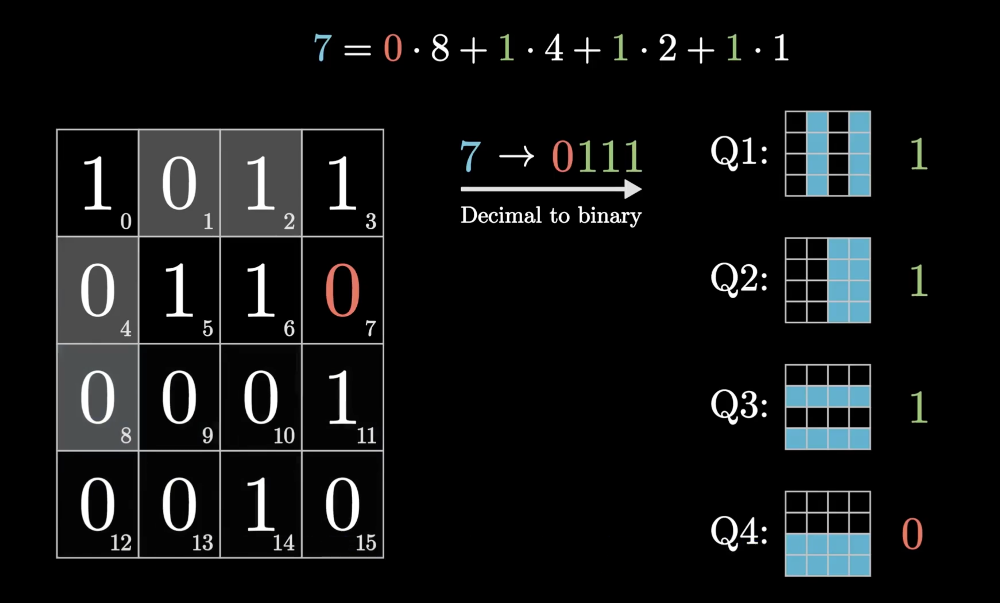
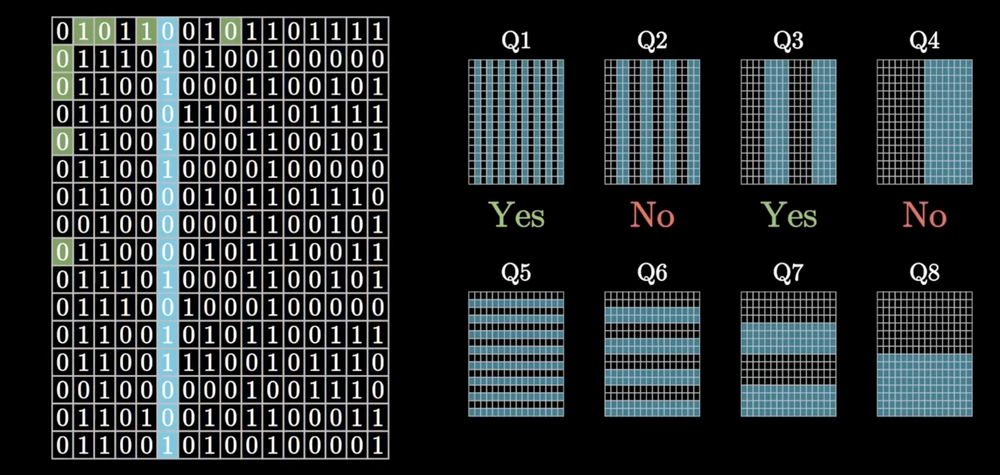

## 3.4 流量控制、可靠传输、滑动窗口机制
可靠传输需要解决三个问题：帧丢失、帧重复、帧失序
流量控制就是要解决收发双方的速率要匹配
### 3.4.1 滑动窗口机制
- 发送窗口 $\displaystyle W_{T}$ transit：发送窗口之外的帧不允许被发送
- 接收窗口 $\displaystyle W_{R}$ receive：接收窗口之外的帧直接被丢弃
- 由接收方通过“**确认机制**”控制发送方的窗口向前滑动，从而实现流量控制
- 后续讲解的几种协议都由一下部分组成：滑动窗口机制、确认机制、重传机制、帧编号

下面的三种协议都属于**ARQ(Automatic Repeat Request)自动重传请求协议**，S-W、GBN、SR都使用了滑动窗口机制，但是**只有后两种可以被称为滑动窗口协议**，后两种也属于连续ARQ协议

### 3.4.2 停止-等待协议 S-W
- 滑动窗口机制： $\displaystyle W_{T}=1，W_{R}=1$
- 确认机制：确认帧(Acknowledge) $\displaystyle ACK_{i}$ ，若接收方收到 $\displaystyle i$ 号1帧，且没有检出“差错”，需要给发送方返回确认帧 $\displaystyle ACK_{i}$
- 重传机制：超时重传，若发送方超时未收到 $\displaystyle ACK_{i}$ ，则重传 $\displaystyle i$ 号帧
- 帧编号：仅需1bit给帧编号，要求 $\displaystyle W_{T}+W_{R}\leq 2^{n}$ ，$\displaystyle n$ 此时为1
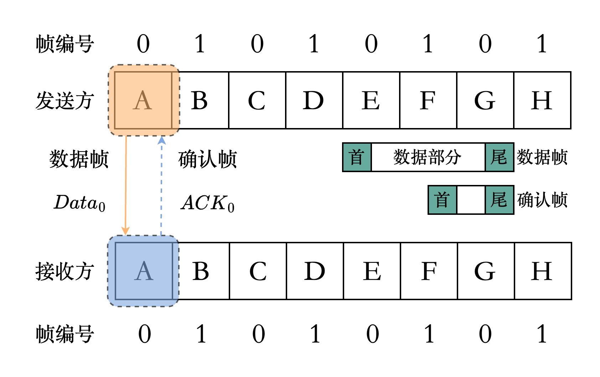
上图中的数据帧首尾部主要是一些控制信息，包括帧定界信息、校验码、**帧类型**(数据帧or确认帧)、帧序号等。确认帧的数据部分通常很短甚至为空

- 正常情况：发送方发送数据帧，接收方收到后返回确认帧，滑动窗口右移
- 数据帧丢失：发送方在发送数据帧后会重置计时器，若超过一定时间没有收到确认帧，则重传数据帧
- 确认帧丢失：接受方收到数据帧后接收窗口右移，发送方超时重传数据帧，接受方在检测到重复帧后（根据帧编号检测）会丢弃重复帧，并重新返回该帧的确认帧
	- 由于接收窗口和发送窗口的距离不超过1，因此用1bit帧编号足矣
- 不会出现帧失序
### 3.4.3 后退N帧协议 GBN Go-Back-N
- 滑动窗口机制： $\displaystyle W_{T}>1，W_{R}=1$
- 确认机制：确认帧(Acknowledge) $\displaystyle ACK_{i}$ ，若接收方收到 $\displaystyle i$ 号1帧，且没有检出“差错”，需要给发送方返回确认帧 $\displaystyle ACK_{i}$
- 重传机制：超时重传，若发送方超时未收到 $\displaystyle ACK_{i}$ ，则重传 $\displaystyle i$ 号帧
- 帧编号：至少需nbit给帧编号，要求 $\displaystyle W_{T}+W_{R}\leq 2^{n}$
- GBN的特殊规则
	- 关于确认帧：接收方可以“**累积确认**”，即连续接收多个数据帧时，**可以仅返回最后一个帧的ACK**，表示接收方已经收到 $\displaystyle i$ 号帧及其之前的所有帧
	- 关于超时重传：若发送方超时未收到ACK，则重传 $\displaystyle i$ 号帧，及其之后的所有帧

以 $\displaystyle W_{T}=3,W_{R}=1$ 为例：
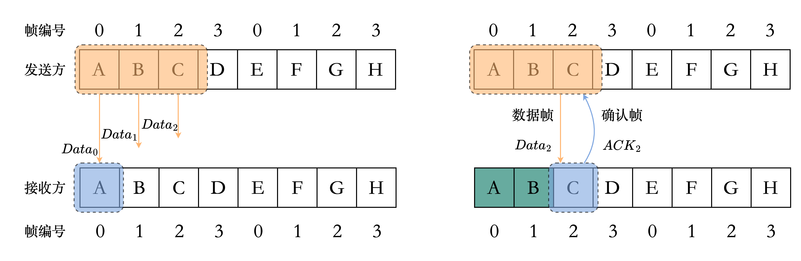
正常情况：一次直接依次发送3帧，滑动窗口依次接收3帧，返回最后一帧的ACK，表示此前所有的帧已经接收

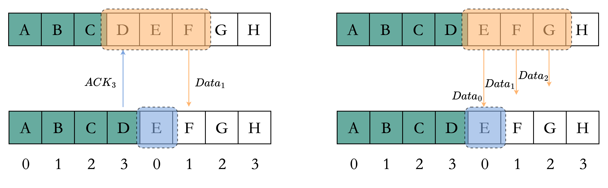
数据帧丢失情况：当收到接收窗口之外的帧时，返回目前已经正确接收的最后一个帧的ACK，即 $\displaystyle ACK_3$ ，发送窗口滑动到3号帧之后。由于未收到0号帧1号帧的确认信息，所以超时重新发送。
该例可看出，原本已经发送了1号帧，现在却“**后退**”回0号帧重新发送，这样也实现了“流量控制”

ACK丢失情况：发送方由于超时未收到此次发送的第一个帧的ACK信号，会将3个帧都重新发送。此时接收方收到一个**非法帧**，于是返回目前已经收到的最后一个正确帧的ACK

如果 $\displaystyle W_{T}+W_{R}\leq 2^{n}$ 不满足：
数据帧可能会错乱，可能出现帧序号相同但是不是正确帧的情况

缺点：如果接收方接收帧的速度很慢，或在信道误码率很高的情况下，可能会导致发送方的发送进度经常需要“后退”，传输效率低下

### 3.4.3 选择重传协议 SR Selective Repeat
- 滑动窗口机制： $\displaystyle W_{T}>1，W_{R}>1$
- 确认机制：确认帧(Acknowledge) $\displaystyle ACK_{i}$ ，若接收方收到 $\displaystyle i$ 号1帧，且没有检出“差错”，需要给发送方返回确认帧 $\displaystyle ACK_{i}$
- 重传机制：超时重传，若发送方超时未收到 $\displaystyle ACK_{i}$ ，则重传 $\displaystyle i$ 号帧
- 帧编号：至少需nbit给帧编号，要求 $\displaystyle W_{T}+W_{R}\leq 2^{n}$
- SR的特殊规则
	- **否认帧NAK**：若接收方收到 $\displaystyle i$ 号帧，但检测出 $\displaystyle i$ 号帧有“差错”，需要丢弃掉该帧，并给发送方返回否认帧 $\displaystyle NAK_{i}$
	- **请求重传**：若发送方收到 $\displaystyle NAK_{i}$ ，则重传 $\displaystyle i$ 号帧
	- $\displaystyle W_{R}\leq W_{T}$ ，即接收窗口不大于发送窗口，实际应用中，通常会取 $\displaystyle W_{R}=W_{T}$ ，这样可以最大限度利用窗口

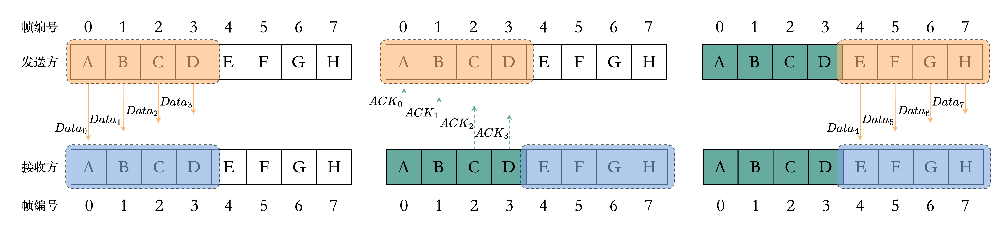
正常情况：接收方连续收到N个帧后，每个帧都需要返回一个ACK，发送窗口移动到第一个未收到确认帧的帧
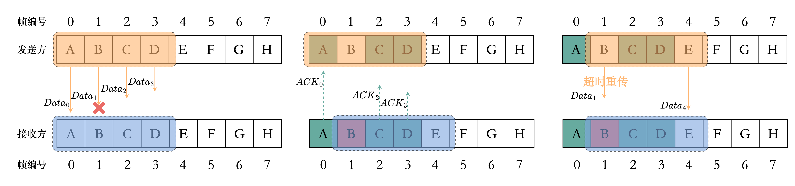
数据帧丢失：发送方收到0号帧的ACK后，发送窗口向右移动，此时4号帧也在发送窗口内，可以发送。但是由于迟迟未收到1号帧的ACK，于是发送方进行超时重传
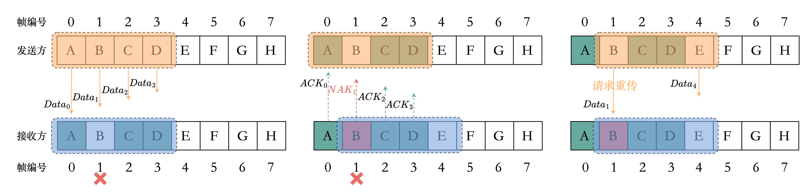
数据帧错误：接收方检出错误后，返回一个NAK信号，接收方收到NAK信号后触发请求重传，重新发送1号帧，这是在计时器超时前完成的。可以发现请求重传的发送时间会比数据帧丢失的情况要早，这样的设计可以提高传输效率
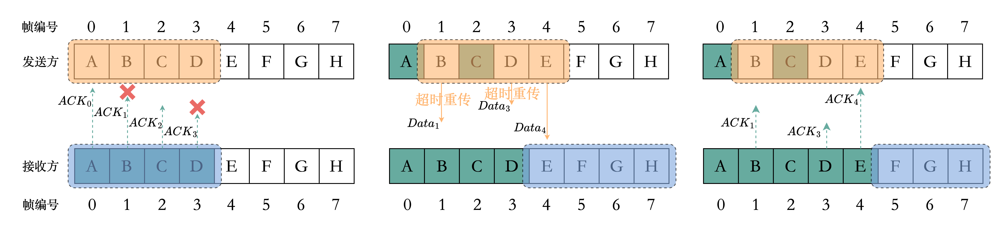
确认帧丢失：接收方迟迟未收到1号和3号帧的ACK，于是触发超时重传。接收方收到重复的数据帧后会丢弃并再次返回重复帧的ACK信息
### 3.4.5 三种协议的信道利用率

#### 3.4.5.1 S-W协议的信道利用率
- 假设：
- 信道的数据传输速率 = 1 kbps
- 数据帧长度 = 4kb
- 确认帧长度 = 1kb
- 信道单向传播时延 = 7s
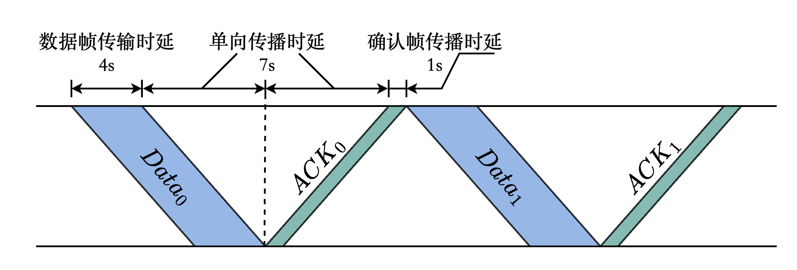
$$
信道利用率=\frac{4}{4+2*7+1}\approx 21\%
$$
理想情况下（没有帧丢失、比特错误等异常情况），信道利用率为
$$
U=\frac{T_{D}}{T_{D}+RTT+T_{A}},
$$
其中， $\displaystyle T_{D}$ 为数据帧传输时延， $\displaystyle T_{A}$ 为确认帧传输时延，RTT为传播往返时间

- 假设：
- 信道的数据传输速率 = 1 kbps
- 数据帧长度 = 4kb
- **确认帧长度非常短，传播时延忽略不计**
- 信道单向传播时延 = 7s
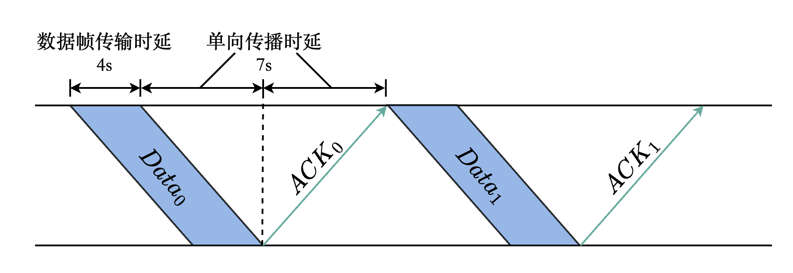
$$
信道利用率=\frac{4}{4+2\times7}\approx 22.22\%
$$ 
#### 3.4.5.2 GBN、SR协议的信道利用率
- 假设
- 发送窗口的大小 N=4
- 信道的数据传输速率 = 1kbps
- 数据帧的长度 = 4kb
- 确认帧长度 = 1kb
- 信道单向传播时延 = 7s
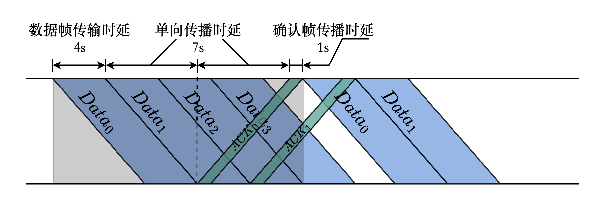
传输周期为黑色矩形跨越的长度，即发出第一个数据帧到完全接收第一个确认帧的总时间
$$
U=\frac{4\times4}{4+2\times7+1}\approx 84\%
$$
理想情况下（没有帧丢失、比特错误等异常情况），信道利用率为
$$
U=\frac{NT_{D}}{T_{D}+RTT+T_{A}},
$$
其中， $\displaystyle N$ 为发送方滑动窗口的大小， $\displaystyle T_{D}$ 为数据帧传输时延， $\displaystyle T_{A}$ 为确认帧传输时延，RTT为传播往返时间
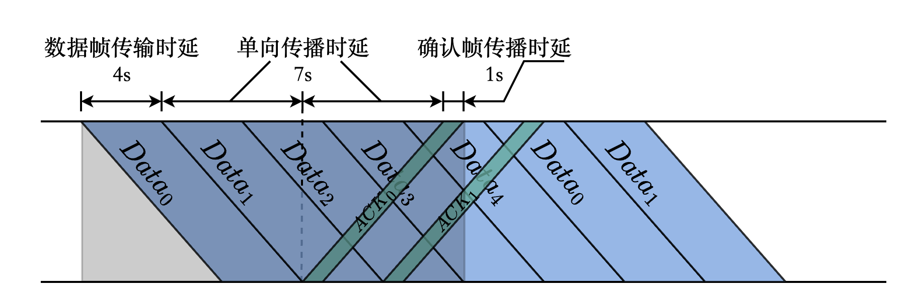
需要注意的是，信道利用率不可能大于1，若 $\displaystyle NT_{D}>T_{D}+RTT+T_{A}$ ，则说明信道上全部时间都有数据在传输，信道利用率最大为1

例题：主机甲通过 128kbps 卫星链路，采用滑动窗口协议向主机乙发送数据，链路单向传播延迟为 250ms，帧长为1000字节。不考虑确认帧的开销，为使链路利用率不小于 80%，帧序号的比特数至少是？

由题意计算得
$$
T_{D}=\frac{1000B}{128kbps}=0.0625s
$$
信道利用率
$$
U=\frac{NT_{D}}{T_{D}+RTT+T_{A}}\geq 80\%
$$
解不等式得：
$$
N\geq 7.2
$$
所以发送方滑动窗口的大小至少为8
GBN、SR协议都需要满足 $\displaystyle W_{T}+W_{R}\leq 2^{n}$
但是GBN只需要 $\displaystyle W_{R}=1$ ，而 $\displaystyle SR$ 需要 $\displaystyle W_{R}>1$ 。**所以，对于相同的编号比特数 $\displaystyle n$ ，GBN可以获得比SR更长的滑动窗口宽度 $\displaystyle W_{T}$ **
$$
2^{n}\geq W_{T}+W_{R}\geq 8+1=9
$$
所以 $\displaystyle n$ 最小为4
## 3.5 信道划分
### 3.5.1 介质访问控制 Medium Access Control
多个节点共享同一个“总线型”广播信道时，可能发生“信号冲突”，介质访问控制MAC就是要解决如何控制各个节点对传输介质的访问，尽量减少甚至避免冲突
#### 3.5.1.1 信道划分
##### 基于时间划分
- 时分复用 Time Division Multiplexing，TDM
	- 将时间分为**等长的“TDM帧”**，每个“TDM帧”又**等分为m个“时隙”**，将m个时隙分配给m对用户（节点）使用
	- 缺点
		- 每个节点**最多只能分配到信道总带宽的 $\displaystyle \frac{1}{m}$ **
		- 如果某节点暂时不发数据，会导致被分配的“时隙”闲置，**导致信道利用率低**
- 统计时分复用 Statistic Time Division Multiplexing，STDM
	- 又称异步时分复用。在TDM的基础上，动态按序分配时隙
	- 优点
		- 如果有需要，一个节点可以在一段时间内**获得所有的信道带宽资源**
		- 如果某节点暂不发送数据，可以不分配“时隙”，**信道利用率更高**
##### 基于带宽划分
- 频分复用 Frequency Division Multiplexing，FDM
	- **将信道的总频带划分为多个子频带**，每个子频带作为一个子信道，每对用户使用一个子信道进行通信，每个子频带之间会设置隔离频带，防止子信道之间相互干扰
	- 发送端和接收端分别有一个复用器和分用器
		- 复用器将各节点发出的信号“复合”后传输到共享信道上
		- 分用器将各个子频带信号“分离”出来
	- 优点：各个节点可以同时发送信号，充分利用了信道带宽
	- 缺点：FDM技术只能用于模拟信号的传输
- 波分复用 Wavelength Division Multiplexing，WDM
	- 光的频分复用，基于 $\displaystyle c=\lambda f$ ，$\displaystyle c$ 表示光速， $\displaystyle \lambda$ 是波长， $\displaystyle f$ 是频率
	- 复用器将各个节点发出的不同波长的光信号“复合”后传输到**光纤**上
	- 分用器将不同波长的光信号“分离”出来
	- 光信号的频带范围（带宽）很大，这是波分复用技术的前提，很容易将一根光纤在逻辑上拆分为多个子信道
##### 码分复用
码分复用 Code Division Multiplexing，CDM
- 给各个节点分配专属“码片序列”
	- “码片序列”包含m个码片（信号值），可看作m维向量，m维**向量的分量通常取 $\displaystyle \pm 1$ **
	- 要求各节点的m维向量必须**正交**
	- 相互通信的**各个节点知道彼此的码片序列**
- 发送方发送数据
	- 节点发出m个信号值与“码片序列”相同，表示比特1
	- 节点发出m个信号值与“码片序列”相反，表示比特0
- 信号在传输过程中“叠加”
	- 当多个发送方同时发送数据时，信号值会叠加（本质是多个m维向量加法）
- 接收方接受数据
	- 从“叠加”信号中分离出各发送方的数据
	- **叠加信号**与**发送方的码片序列**作“**规格化内积**”
		- 结果为1，表示比特1
		- 结果为0，表示比特0

- 假设现在有A、B、C三个信号站：
- A的m维码片序列 $\displaystyle \vec{a}=(1,1,1,1)$
	- A站发送信号值 $\displaystyle \vec{a}=(1,1,1,1)$ 表示二进制1
	- A站发送信号值 $\displaystyle -\vec{a}=(-1,-1,-1,-1)$ 表示二进制0
- B的m维码片序列 $\displaystyle \vec{b}=(1,-1,1,-1)$
	- B站发送信号值 $\displaystyle \vec{b}=(1,-1,1,-1)$ 表示二进制1
	- B站发送信号值 $\displaystyle -\vec{b}=(-1,1,-1,1)$ 表示二进制0
- C的m维码片序列 $\displaystyle \vec{c}=(1,1,-1,-1)$
	- C站发送信号值 $\displaystyle \vec{c}=(1,1,-1,-1)$ 表示二进制1
	- C站发送信号值 $\displaystyle -\vec{c}=(-1,-1,1,1)$ 表示二进制0
- 三个向量相互正交： $\displaystyle \vec{a}\cdot\vec{b}=\vec{a}\cdot \vec{c}=\vec{b}\cdot \vec{c}=\vec{0}$ ，这样才可以将各个信号站的信号分离出来

假设此时C收到“叠加”信号值 $\displaystyle (0,2,0,2)=\vec{a}-\vec{b}$
与节点A的码片序列作“规格化内积”
$$
\frac{1}{m}\vec{a}\cdot(\vec{a}+(-\vec{b}))=\frac{1}{m}\vec{a}\cdot \vec{a}=1
$$
$\displaystyle m$ 是码片序列的维数，这样就知道节点A发送的信号是比特1；
与节点B的码片序列作“规格化内积”
$$
\frac{1}{m}\vec{b}\cdot(\vec{a}+(-\vec{b}))=\frac{1}{m}\vec{b}\cdot(-\vec{b})=-1
$$
这样就知道节点B发送的信号是比特0

#### 3.5.1.2 随机访问
##### ALOHA协议 Additive Links Online Hawaii Area
- 纯ALOHA：如果准备好数据帧，就**立刻发送**
- 时隙ALOHA
	- **时隙大小固定等于一个最长帧所需的时间**
	- **只有每个时隙开始时才能发送帧**
	- 避免了节点发送数据的随意性，降低了冲突发生的概率，提高信道利用率
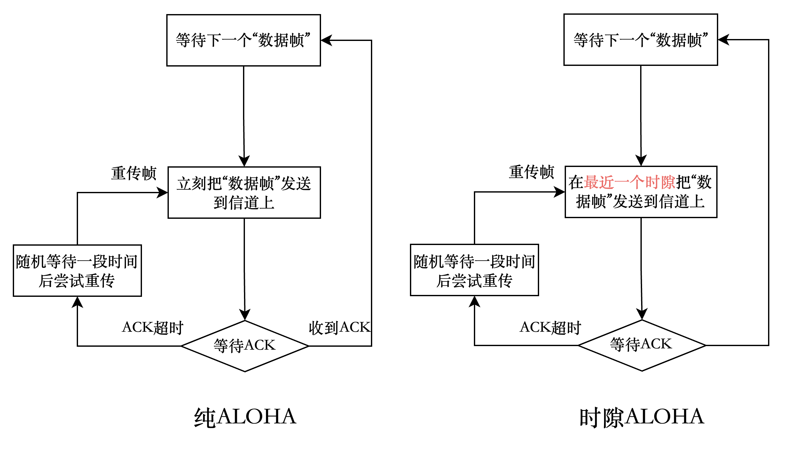
等待随机时间重传是因为避免周期性的冲突
##### CSMA协议 Carrier Sense Multiple Access
CSMA，即载波**监听**多路访问协议，在ALOHA协议基础上改进：在发送数据之前，先监听信道是否空闲，只有信道空闲时，才尝试发送。
要求节点的网络适配器安装“载波监听装置”，用于监听信道上是否有其他节点在发送数据

- 1-坚持CSMA协议
	- 优点：信道利用率高，信道一旦空闲，就可以被下一个节点使用
	- 缺点：当多个节点都已经准备好数据时，一旦信道空闲，会有多个节点同时发送数据，冲突概率大
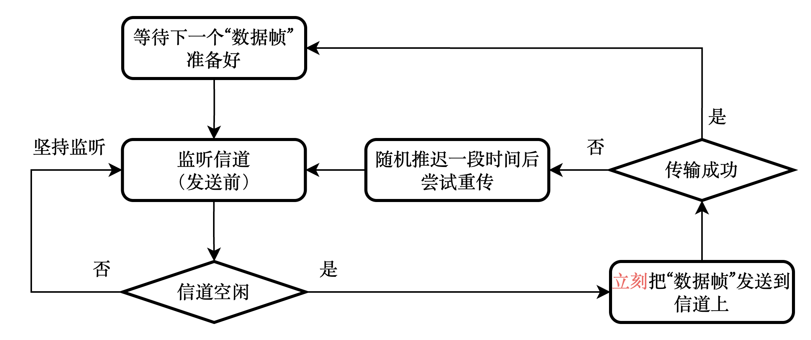
- 非坚持CSMA协议
	- 与1-坚持CSMA协议区别在于监听到信道非空间后推迟一段时间再次监听
	- 优点：在监听到信道不空闲后，各节点错开发送数据，这样可以避免多个节点同时准备好数据后发生冲突
	- 缺点：信道刚恢复空闲时，可能不会立即被利用，导致信道利用率降低

- p-坚持CSMA协议
	- 优点：是前两种CSMA的折中方案，降低冲突概率的同时，提升信道利用率
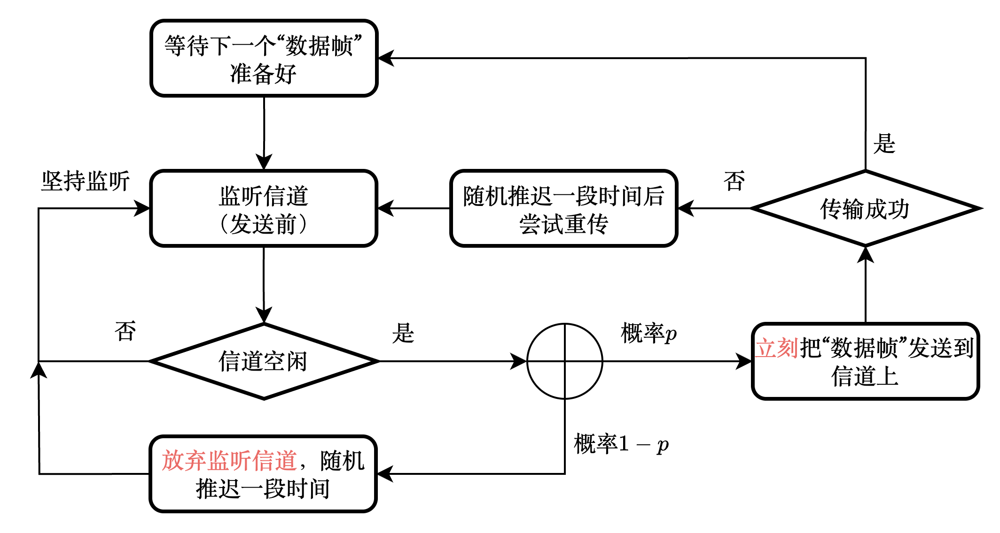
##### CSMA/CD协议 Collision Detection
- 协议要点
	- 先听后发，边听边发，**冲突停发**，**随机重发**
	- 随机重发要点：**截断二进制指数退避算法**
		- 随机等待一段时间=r倍的争用期，其中r是随机数
		- 如果 $\displaystyle k\leq 10$ ，在 $\displaystyle [0,2^{k}-1]$ 区间内随机取一个整数
		- 如果 $\displaystyle k> 10$ ，在 $\displaystyle [0,2^{10}-1]$ 区间内随机取一个整数
	- 特别的：
		- 第10次冲突，是“随机重发”的分水岭
		- 第16次冲突，直接放弃传帧，报告网络层，*躺平上报*

##### CSMA/CA协议

#### 3.5.1.3 轮询访问